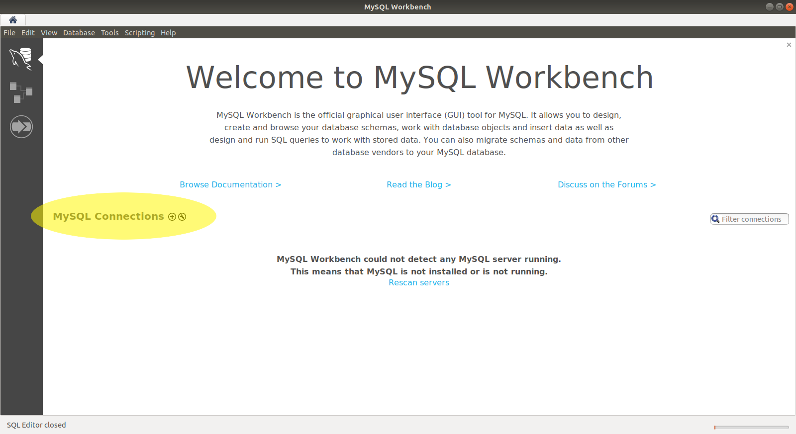
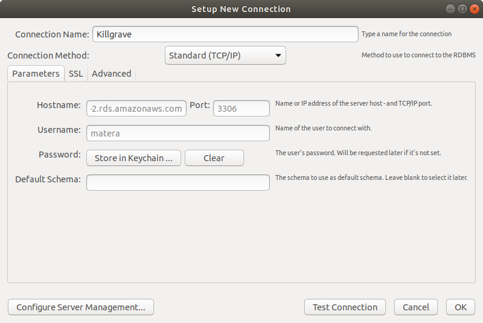
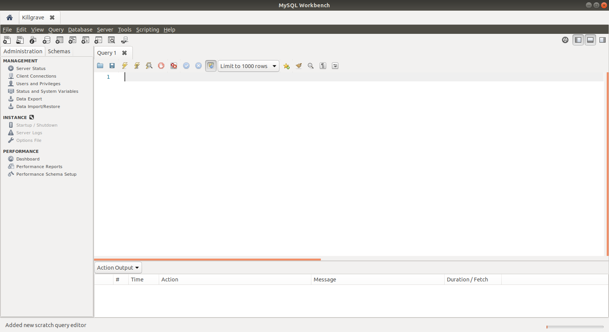

# Connect to Killgrave 

Killgrave is a MySQL server in Amazon's cloud. The class will use Killgrave as a shared DBMS, which will allow me to share schemas with you. This lab will take you through establishing a connection to Killgrave. 

## Step 1: Start MySQL Workbench 

On the opening screen of MySQL workbench click the plus (`+`) icon. 

## Step 2: Enter Connection Information 

You will see the new connection dialog shown below: 

Enter the following information:

  * **Connection Name**: Killgrave
  * **Hostname**: `killgrave.cis.cabrillo.edu`
  * **Username**: See the [Account Access FAQ](/faq) 
  * **Password**: See the [Account Access FAQ](/faq)
  
> Note: You will be prompted to enter your password later.

Click "OK" to create the new connection. 

## Step 3: Open the Connection 

When you return to the home screen you should see a new connection. Click it and you'll be prompted for your password. You can ask MySQL workbench to store you password for future connection attempts. 

Once connected you will see a screen similar to this: 

**Take a screenshot of the connection screen**

## Turn In 

Turn in the screenshot from step 3. 
